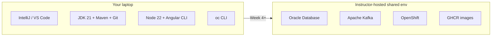

# Final lab environment — Java & Angular Fullstack

This course uses **instructor-hosted shared services** from Week 4 onward. Participants develop on their laptop. They do **not** install Oracle, Kafka, or OpenShift locally.

**Stack (Option A — matches the Angular outline):**

| Shared service | Used from | Client on the laptop |
| -------------- | --------- | -------------------- |
| **Oracle Database** | Week 4 (Labs 37–39, 50) | SQL Developer, SQLcl, or SQL*Plus (optional) |
| **Apache Kafka** | Week 4 (Labs 30–32, 46, 49) | none required (Spring Kafka from the app) |
| **OpenShift** | Week 5 (Labs 42, 51) | `oc` + instructor login / kubeconfig |
| **GitHub Actions + GHCR** | Week 5 (Labs 43–44, 51) | GitHub account |

CI/CD is **GitHub Actions** with code scanning. **Do not** use Bitbucket Pipelines.

Connection details (host, service name, username, password, `oc login`) are handed out by the instructor. **Never commit** passwords, kubeconfigs, or `.env` files.

This is **not** the Java Software Engineer cohort env (PostgreSQL + k3s). Copied JSE lab steps that still mention Postgres or k3s are leftover wording until those labs are rewritten here.

Reachability requires the class IP allowlist (or instructor VPN).
